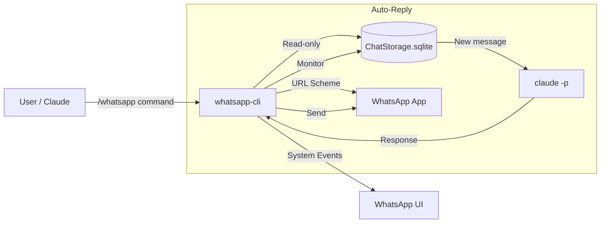

# whatsapp-cli

Claude Code plugin for full control over **WhatsApp** on macOS. Read chats, send messages to individuals and groups, search conversations, auto-reply with AI, monitor in real-time, and export chat history.

## Features

- **Read chats** — list conversations, unread messages, starred messages
- **Send messages** — to contacts and groups (auto-detects group JIDs)
- **Search** — full-text search across all conversations
- **Groups** — list groups, members, group info
- **Contacts** — list, search, resolve names to JIDs
- **Auto-reply** — AI-powered auto-reply using Claude as response generator
- **Monitor** — watch chats in real-time for new messages
- **Export** — export chat history to TXT, JSON, or CSV; export media files
- **Interactive REPL** — full-featured REPL with history and styled prompts

## Requirements

- **macOS** (uses WhatsApp's local SQLite database)
- **WhatsApp desktop app** installed and logged in
- **Python 3.10+**
- **Accessibility permissions** for sending (System Settings > Privacy & Security > Accessibility)
- **Claude Code** CLI (for plugin usage and auto-reply)

## Installation

### Via Claude Code

```bash
claude plugins marketplace add marcelrgberger/whatsapp-cli
claude plugins install whatsapp-cli
```

The CLI backend installs automatically on first `/whatsapp` use.

### Manual

```bash
git clone https://github.com/marcelrgberger/whatsapp-cli.git
cd whatsapp-cli/agent-harness
python3 -m venv .venv
source .venv/bin/activate
pip install -e .
```

## Usage

### Slash Commands

```
/whatsapp                        List recent chats
/whatsapp unread                 Show unread chats
/whatsapp read "John"            Read messages from John
/whatsapp send "John" Hello!     Send message to John
/whatsapp search "meeting"       Search all messages
/whatsapp groups                 List all groups
/whatsapp export "John" ./out    Export chat history
/whatsapp monitor "John"         Watch for new messages
/whatsapp auto-reply "John"      AI auto-reply
```

### Natural Language

After installing the plugin, just tell Claude what you want:

- "Show my unread WhatsApp messages"
- "What did John say on WhatsApp?"
- "Send a WhatsApp to the SoundClouds group saying I'll be late"
- "Search WhatsApp for the restaurant address"
- "Auto-reply to Max while I'm away"

### Direct CLI

```bash
whatsapp-cli chat list --limit 10
whatsapp-cli chat unread
whatsapp-cli message get "John" --limit 50
whatsapp-cli message send "John" "Hello!"
whatsapp-cli message search "meeting"
whatsapp-cli group list
whatsapp-cli group info "Family"
whatsapp-cli export chat "John" ./chat.txt --format txt
whatsapp-cli monitor auto-reply --chat "John" --prompt "Reply friendly" --interval 10
whatsapp-cli  # Launches interactive REPL
```

## Command Reference

### Chat
| Command | Description |
|---------|-------------|
| `chat list [--limit N] [--groups/--no-groups]` | List recent chats |
| `chat search <query>` | Search chats by name |
| `chat unread` | Show unread chats |
| `chat get <name_or_jid>` | Get chat details |
| `chat find <phone>` | Find chat by phone number |

### Message
| Command | Description |
|---------|-------------|
| `message get <name> [--limit N] [--before/--after DATE]` | Get messages |
| `message search <query> [--chat NAME]` | Search messages |
| `message starred [--chat NAME]` | Get starred messages |
| `message media <name> [--limit N]` | Get media messages |
| `message send <name_or_phone> <text>` | Send message (contacts & groups) |
| `message count [--chat NAME]` | Count messages |

### Contact
| Command | Description |
|---------|-------------|
| `contact list` | List contacts |
| `contact search <query>` | Search contacts |
| `contact info <name_or_jid>` | Contact details |
| `contact resolve <name>` | Resolve name to JID |

### Group
| Command | Description |
|---------|-------------|
| `group list` | List all groups |
| `group info <name_or_jid>` | Group details |
| `group members <name_or_jid>` | List group members |
| `group search <query>` | Search groups |

### Monitor
| Command | Description |
|---------|-------------|
| `monitor watch [--chat NAME] [--interval N]` | Watch for new messages |
| `monitor since <timestamp> [--chat NAME]` | Messages since timestamp |
| `monitor auto-reply --chat NAME --prompt PROMPT [--interval N]` | AI auto-reply |

### Export
| Command | Description |
|---------|-------------|
| `export chat <name> <output> [--format txt/json/csv]` | Export chat history |
| `export media <name> <output_dir>` | Export media files |

### Session
| Command | Description |
|---------|-------------|
| `session status` | WhatsApp status, DB stats |

## Auto-Reply with AI

The killer feature — set up Claude as an auto-responder:

```bash
whatsapp-cli monitor auto-reply \
  --chat "John" \
  --prompt "You are me, reply casually and friendly. Max 1-2 sentences." \
  --interval 10 \
  --context-messages 20
```

This will:
1. Poll the chat every 10 seconds
2. When a new message arrives (not from you), gather the last 20 messages as context
3. Call `claude -p` to generate a contextual reply
4. Send the reply automatically via WhatsApp

Works with both individual chats and group chats. Run multiple auto-reply bots in parallel for different chats.

### Data Flow



## Architecture

```
whatsapp-cli/
├── .claude-plugin/              Plugin metadata + marketplace
├── commands/whatsapp.md         /whatsapp slash command
├── skills/whatsapp/SKILL.md     NLP skill
├── agent-harness/
│   ├── setup.py
│   └── whatsapp_cli/
│       ├── whatsapp_cli.py      Click CLI + REPL (2000+ lines)
│       ├── core/
│       │   ├── chats.py         Chat listing, search, unread
│       │   ├── messages.py      Message read, search, send
│       │   ├── contacts.py      Contact management
│       │   ├── groups.py        Group info, members
│       │   ├── monitor.py       Real-time monitoring
│       │   ├── export.py        Chat/media export
│       │   └── session.py       Session state
│       └── utils/
│           ├── wa_backend.py    SQLite + URL scheme + System Events
│           └── repl_skin.py     REPL interface
└── README.md
```

### How It Works

- **Reading**: Direct read-only SQLite access to WhatsApp's `ChatStorage.sqlite` in `~/Library/Group Containers/group.net.whatsapp.WhatsApp.shared/`
- **Sending to contacts**: `whatsapp://send?phone=...&text=...` URL scheme + System Events Enter keystroke
- **Sending to groups**: `whatsapp://chat?jid=...@g.us` URL scheme + System Events typing + Enter keystroke
- **Monitoring**: Polls SQLite database at configurable intervals
- **Auto-reply**: Monitor + Claude CLI (`claude -p`) + Send pipeline

## Security

- **Read-only database access** — never writes to WhatsApp's database
- **Official send mechanism** — messages go through WhatsApp's desktop app with end-to-end encryption
- **Local only** — no data leaves your machine, no external APIs (except Claude for auto-reply)
- **No credentials stored** — no WhatsApp tokens or passwords

## License

MIT
